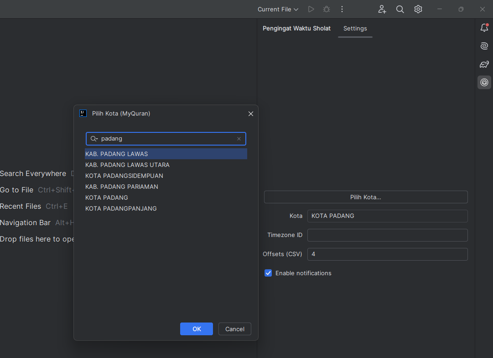
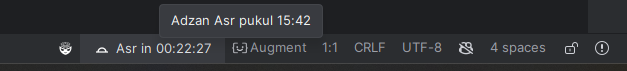
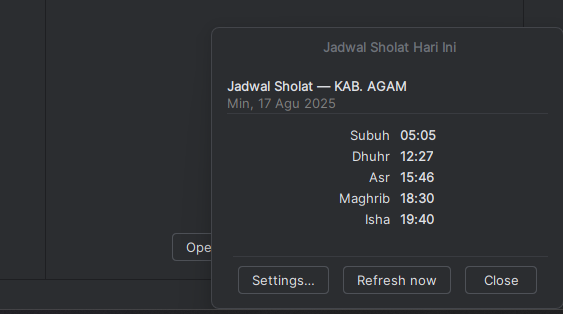
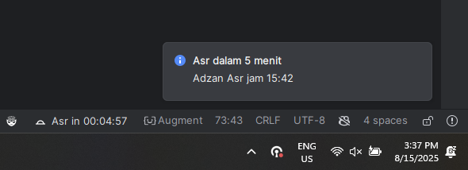

# 🕌 IntelliJ Pengingat Waktu Sholat


**Pengingat Sholat** adalah plugin untuk IntelliJ IDEA (dan IDE JetBrains lain) yang menampilkan jadwal sholat harian dan countdown menuju adzan.  
Cocok buat developer muslim yang sering lupa waktu sholat karena fokus ngoding 👨‍💻.
## ✨ Fitur Utama

- 🔔 **Notifikasi pengingat sholat** (bisa diatur offset, misalnya 5/10 menit sebelum adzan).
- ⏳ **Countdown di Status Bar** menuju adzan berikutnya / reminder.
- 📌 **Tool Window** khusus untuk konfigurasi cepat:
    - Pilih kota via API [MyQuran](https://api.myquran.com/).
    - Atur timezone manual (opsional).
    - Atur offsets reminder dalam menit (CSV).
    - Toggle notifikasi on/off.
    - Pilih mode countdown → ke **adzan** langsung atau ke **reminder offset**.
- 🖼️ **Popup detail jadwal harian** saat klik ikon di status bar.
- ⚡ **Refresh jadwal** langsung dari API.
- 🎨 **Ikon adaptif** sesuai tema (light/dark mode).
- 🗂️ **Overview panel** di Settings → tampilkan semua fitur & screenshot.
## 📷 Screenshot

### Settings


### Status Bar Countdown


### Detail Waktu Sholat


### Popup Notif Pengingat Adzan


### Tool Window Config

## ⚙️ Cara Install

### 1. Dari Source (dev mode)
1. Clone repo ini:

```bash
git clone https://github.com/yogisyaputra/plugin-intellij-pengingat-waktu-sholat.git
cd plugin-intellij-pengingat-waktu-sholat
```
2. Jalankan IDE sandbox:
```bash
./gradlew runIde
```
Hasil ZIP ada di build/distributions/plugin-intellij-pengingat-waktu-sholat-<versi>.zip.

Install via Settings → Plugins → ⚙ Install Plugin from Disk.
## Tech Stack

- **Bahasa:** [Kotlin](https://kotlinlang.org/) (JVM 17)
- **Build Tool:** [Gradle](https://gradle.org/) dengan plugin `org.jetbrains.intellij`
- **UI Framework:** JetBrains Platform UI (JBPanel, JBLabel, JBPopup, ToolWindow, StatusBarWidget)
- **HTTP Client:** [OkHttp](https://square.github.io/okhttp/)
- **JSON Parser:** [Moshi](https://github.com/square/moshi) (+ `moshi-kotlin`)
- **Scheduler:** `ScheduledExecutorService` untuk menghitung dan menjadwalkan reminder
- **Icon & Theming:** SVG icons + `IconLoader`, dengan dukungan **light/dark theme**
- **API Data:** [MyQuran API](https://api.myquran.com/) sebagai sumber jadwal sholat

📂 Struktur Direktori (ringkas):
```bash
src/
└─ main/
├─ kotlin/id/ysydev/sholatreminder/
│ ├─ core/ # scheduler, state, startup
│ ├─ api/ # MyQuranApiClient + models
│ └─ ui/ # status bar, tool window, settings, actions
└─ resources/
├─ icons/ # SVG icons (fajr.svg, dhuhr.svg, ...)
└─ screenshots/ # README images (opsional)
```

## 🙏 Kredit

- **[MyQuran API](https://api.myquran.com/)** → sumber data jadwal sholat harian & daftar kota.
- **JetBrains IntelliJ Platform SDK** → basis pengembangan plugin untuk IntelliJ & Android Studio.
- **OkHttp & Moshi (Square)** → library untuk HTTP client & JSON parsing.
- **Ikon** → ikon sholat sederhana berbasis SVG, dengan dukungan light/dark theme.
## License

[MIT](https://choosealicense.com/licenses/mit/) License © 2025 Yogi Syaputra

